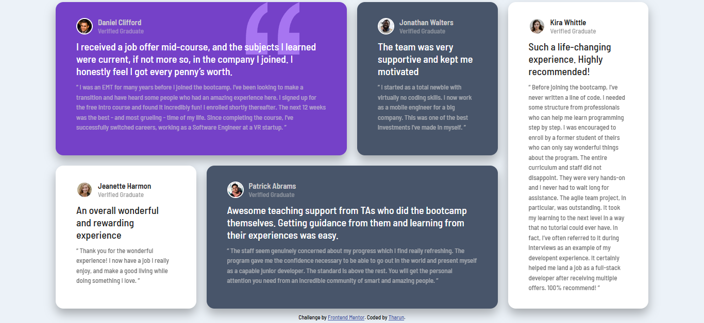
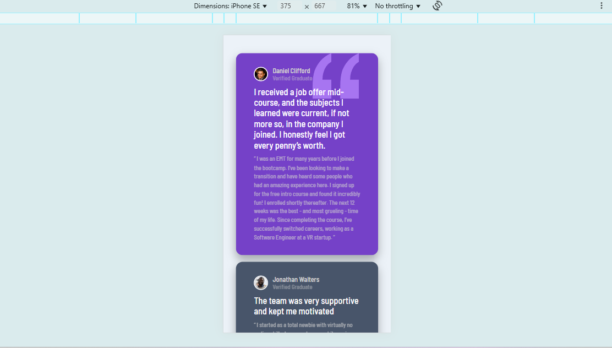

# Frontend Mentor - Product preview card component solution

This is a solution to the [Product preview card component challenge on Frontend Mentor](https://www.frontendmentor.io/challenges/product-preview-card-component-GO7UmttRfa). Frontend Mentor challenges help you improve your coding skills by building realistic projects. 

## Table of contents

- [Overview](#overview)
  - [The challenge](#the-challenge)
  - [Screenshot](#screenshot)
  - [Links](#links)
- [My process](#my-process)
  - [Built with](#built-with)
  - [What I learned](#what-i-learned)
- [Author](#author)
- [Acknowledgments](#acknowledgments)
## Overview

### The challenge

Users should be able to:

- View the optimal layout depending on their device's screen size
- See hover and focus states for interactive elements

### Screenshot

### Links

- Solution URL: https://github.com/tharun-32/Testimonials-grid-section
- Live Site URL: https://testimonial-grit-section.netlify.app/

## My process

### Built with

- Semantic HTML5 markup
- CSS custom properties
- Flexbox
- Mobile-first workflow

### What I learned

Through this project I have learned how to use CSS Flexbox and how to turn desktop design into a mobile friendly design. This is a challengeing
design for me to create as a beginner without the help of figma design.

learned how to use CSS media property well. 

## Author

- Github- [tharun-32](https://github.com/tharun-32)
- Frontend Mentor - [tharun-32](https://www.frontendmentor.io/profile/tharun-32)

## Acknowledgments

Thanks "Frontend Mentor" for giving this challenge this helped to improve my css skills.
